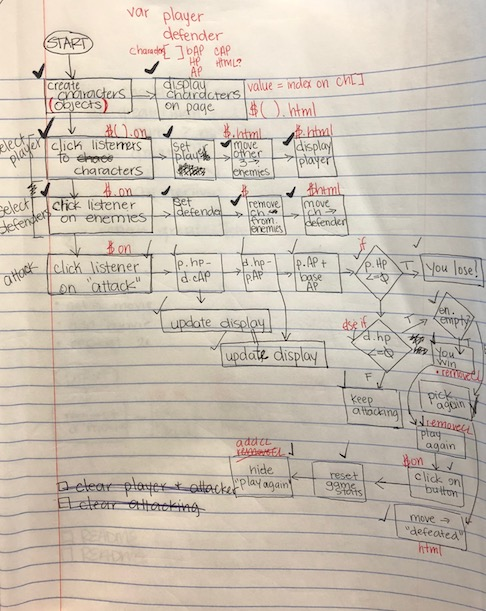

# X-Men Battle Royale

An X-Men themed VS battle game built with jQuery as its library for DOM manipulation. Play as Jean Grey, Magneto, Rogue or Angel. When a Player is selected from the list of the four characters, the characters not selected become Enemies. Players and Enemies move to their respective sections of the page and Attack can commence. Defeat all three enemies to win the game.

## Deployment

Deployed via GitHub Pages [here](https://javascriptress.com/xmen-rpg/)

## Built With

* [jQuery](https://jquery.com/) - The framework used for DOM manipulation
* [jQuery Modal](https://getbootstrap.com/docs/3.3/) - Used to generate "game over" modals
* [Bootstrap](https://rometools.github.io/rome/) - For responsive styling

## Flowchart

## Acknowledgments

* Thanks for those who helped me find character images
* X-Men characters are sole properties of Marvel Comics

